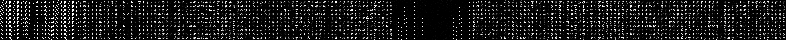

# Conditional Generative Adversarial Nets

> Conditional Generative Adversarial Nets   [[Paper Link](https://arxiv.org/pdf/1411.1784.pdf)]

**Pytorch implementation of Partial conditional Generative Adversarial Networks**

Our goal is when we will give two conditions, makes two digits number image. But, only give one condition when training.

## Result

